```{r}
#| include: false
knitr::opts_chunk$set(
  echo = FALSE
)
library(qrcode)
```

## What is Course Schedulizer 2.0?  

<style>
div.centered {
  margin: auto;
  text-align: center;
}
</style>


-   A webapp for creating, editing, and viewing course schedules

-   Complete rewrite of Course Schedulizer 1.0
    - Retains most of the features, much of the interface
    - Adds several new features (more later)
    - Not currently a student project

## Plan

1. Quick tour of important features (What, now how)

2. BTS with Jenna Hunt

3. But can it _____ ?

4. Live demo (watch or follow along)

5. Try it on your own department schedule

    * Make progress or just try out features
    * See if you can break anything
    * Let me know how it could be better
    

## Where is Course Schedulizer?

::: {.centered}

<https://schedulizer.pruim.co>

```{r}
url <- "https://schedulizer.pruim.co"
qr_code(url) |>
  generate_svg(
    size = 300,
    foreground = "#8c2131",
    file = "images/schedulizer-qr.svg"
  )
```


:::

## Schedulizer is a web app

* It runs in your browser. There is no backend database or storage.

* If you browser cache is cleared or overflows or you switch browsers, you will not have your data, unless

* You have exported it (download a file or save on OneDrive).


# Quick Tour

## Department View

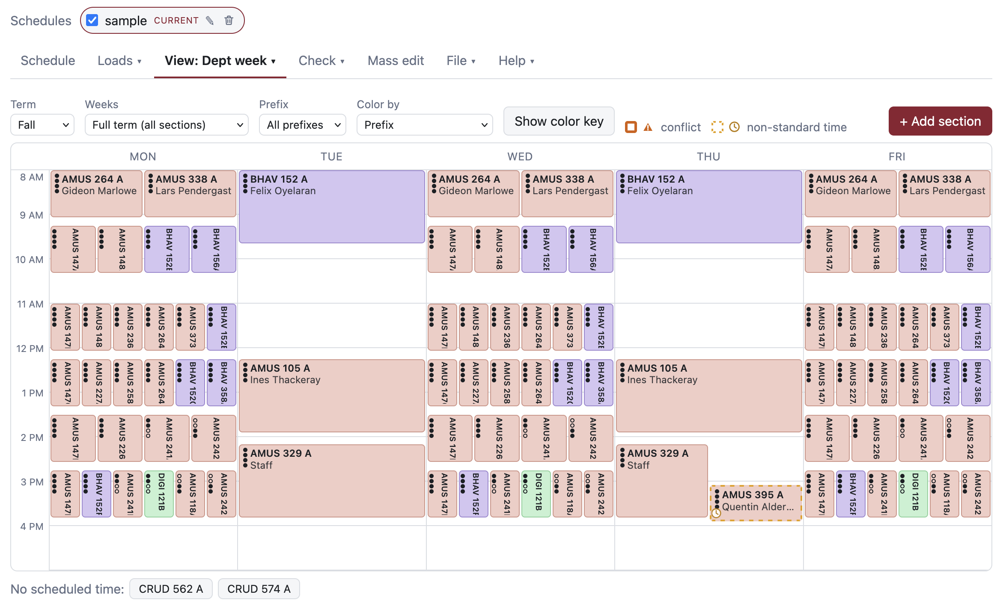

## Faculty View

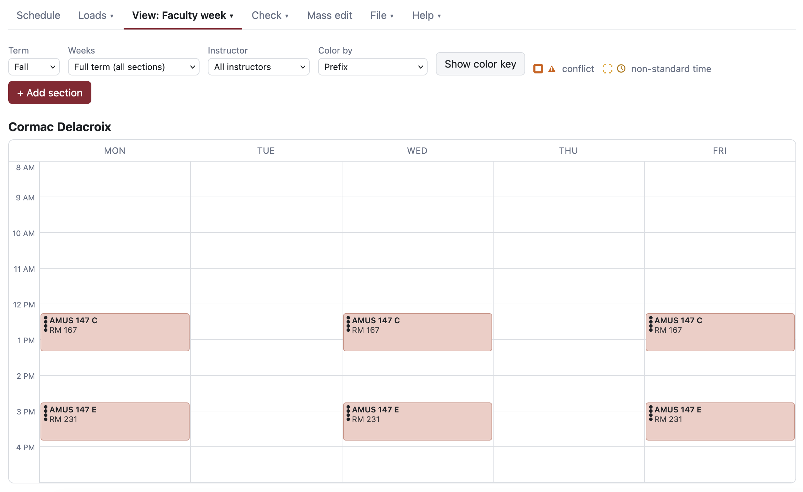

## Room View

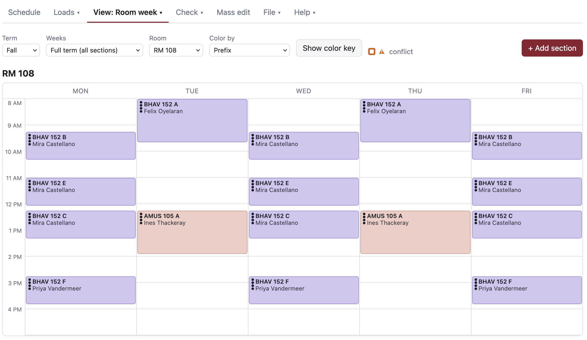


## (Teaching) Loads View

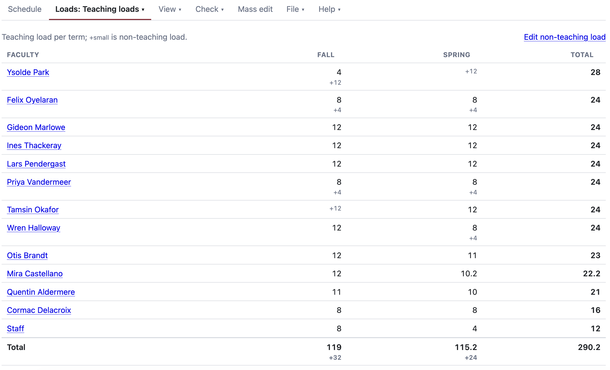

## Creating/Updating Sections

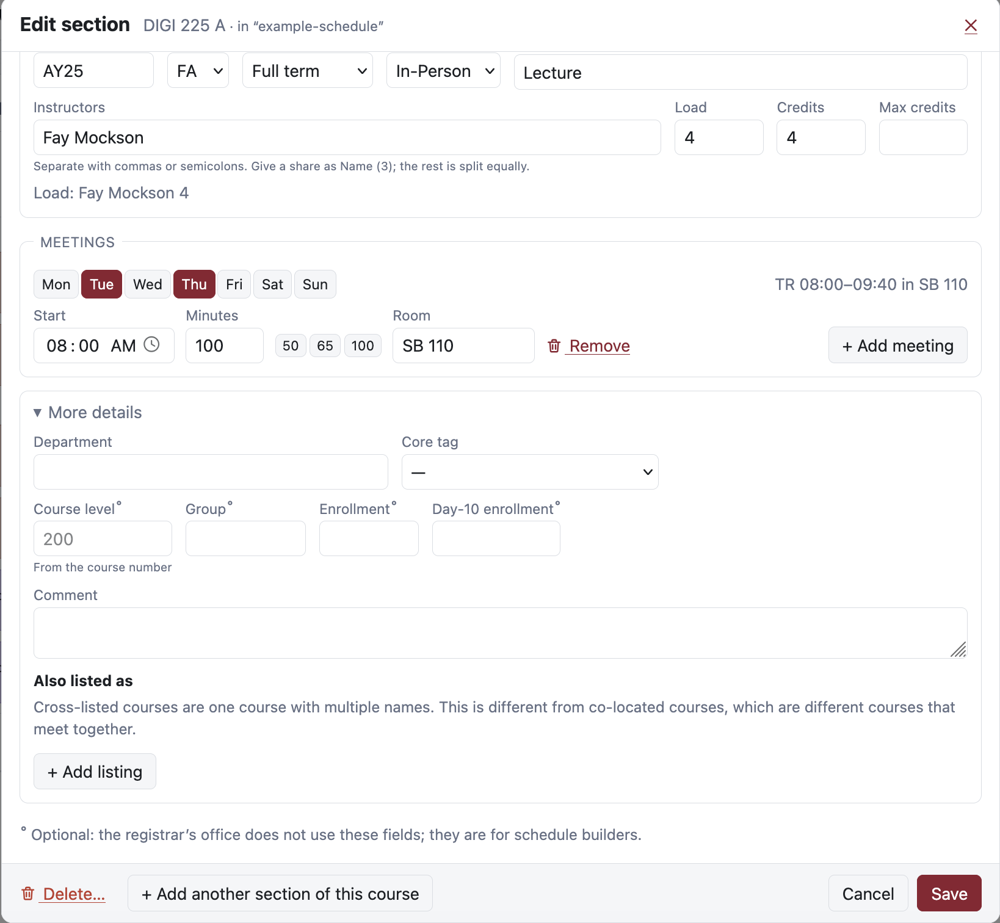

## Conflicts & Custom Constraints  

See which of your scheduled courses conflicts with another course
or a constraint rule.

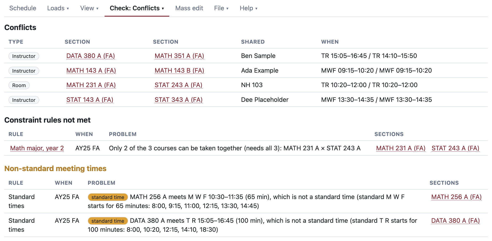

## Conflicts in the the section editor

Conflicts also appear at the bottom of the section editor and 
update live as you enter information.

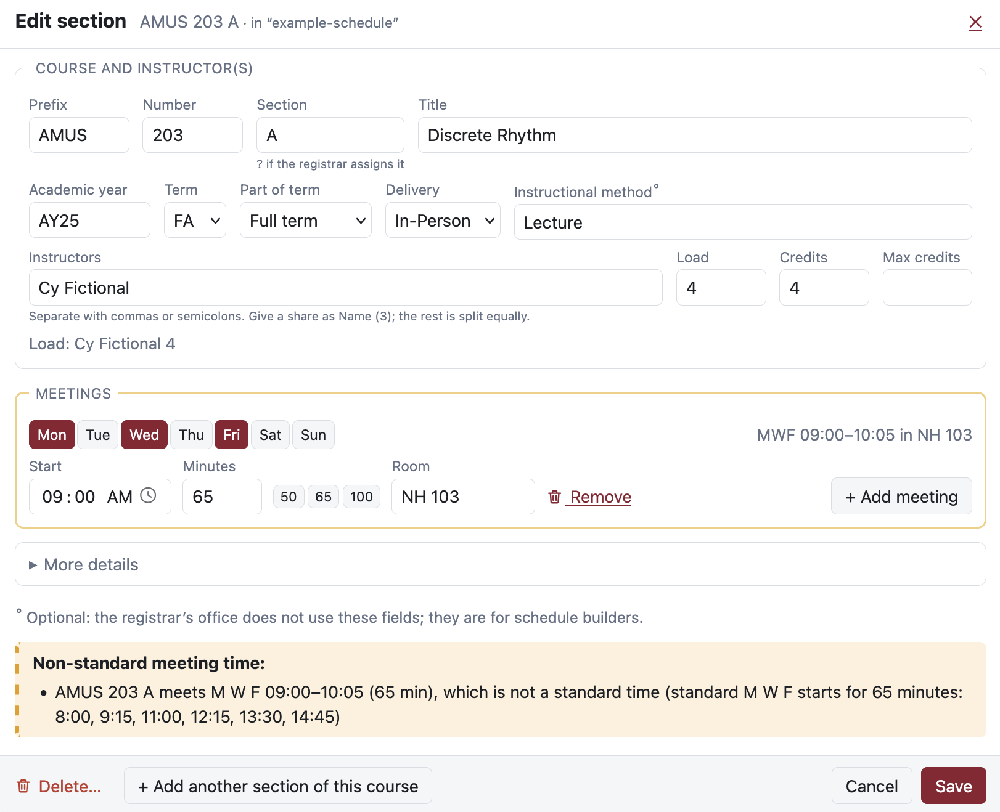


## Constraint Rules  

You can add or remove constraints by creating constraint rules.

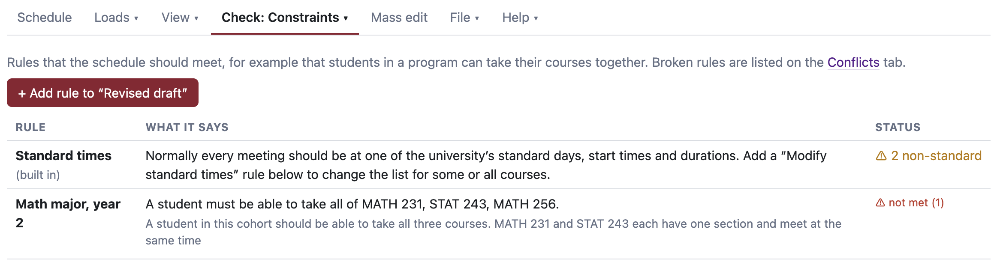

## Compare Schedules  

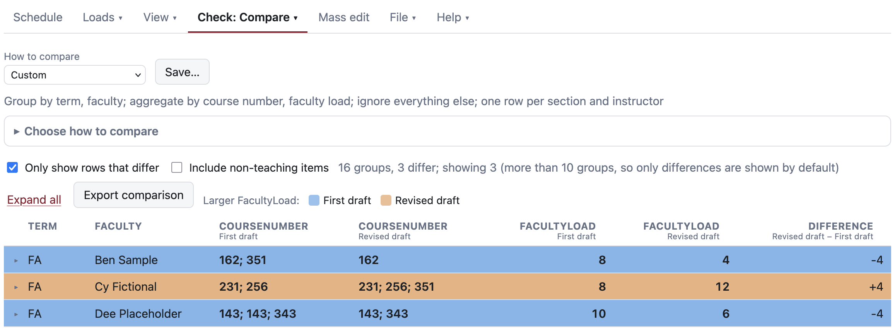

## Mass Edits  

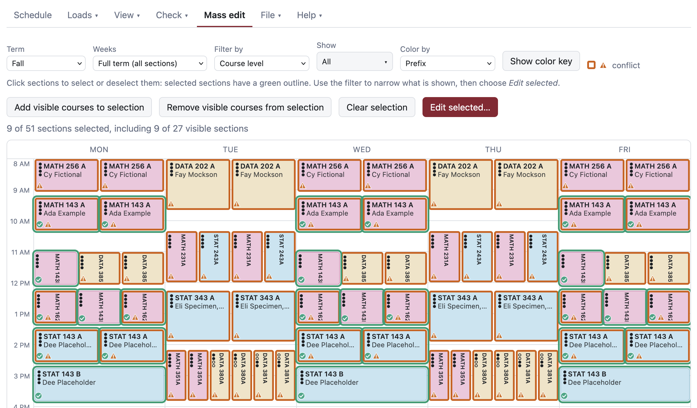

## Cross-listed courses (and and tags) officially supported  

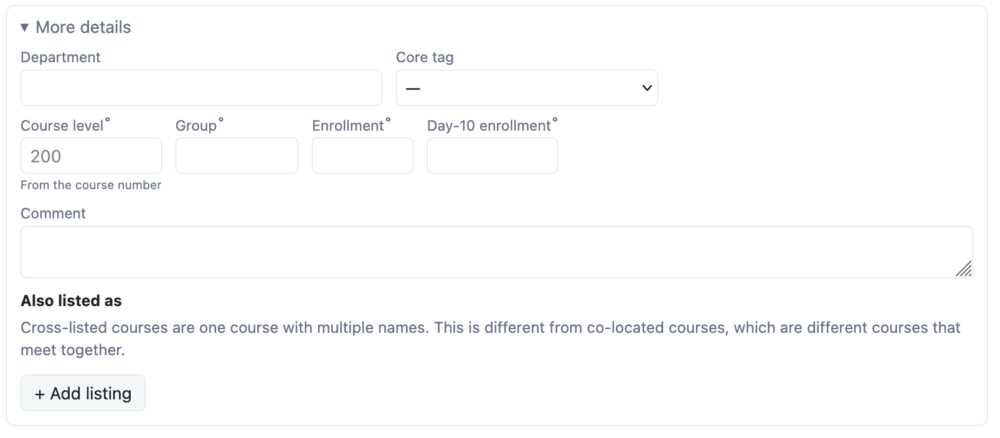

## Connect directly to OneDrive 

Schedulizer can read/write from/to OneDrive.

* Provides a way to share your schedule with others.


## Issues

-   **Use the Comment field** to communicate to your dean and Student Success if you can't get Course Schedulizer to do exactly what you want.

:::{.fragment}

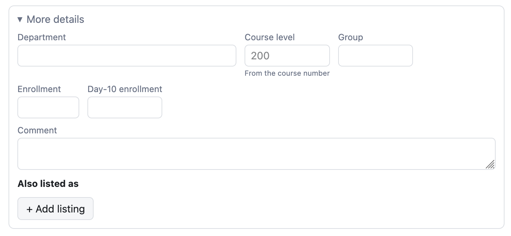
:::

-   **Bugs?** Email rpruim\@gmail.com

-   **Feature requests?** Email rpruim\@gmail.com

# BTS with Jenna

# But can it _____ ?

## Yes, but can Schedulizer _____ ?

<br />
<br />

#### **You**: Fill in the blank.

<br />

#### **I'll** answer briefly 

* Yes 
* No 
* I don't know 
* Stay tuned (it's in the demo)
* Etc.


# Live Demo

## Where is Course Schedulizer?

::: {.centered}

<https://schedulizer.pruim.co>

```{r}
url <- "https://schedulizer.pruim.co"
qr_code(url) |>
  generate_svg(
    size = 300,
    foreground = "#8c2131",
    file = "images/schedulizer-qr.svg"
  )
```


:::
## Outline of the Schedulizer workflow

1. **Import** one or more schedules.

2. **Look** over your schedule using one of the calendar views.

3. **Change**  what needs changing.

4. **Check** your schedule by examining loads,
   investigating conflicts, or comparing schedules.

5. **Export** to Excel to save your work for next time or 
so you can send it.

## 0. Getting Help

* **Help > User guide**


## 1. **Import** an example schedule

Choose **Example schedule**

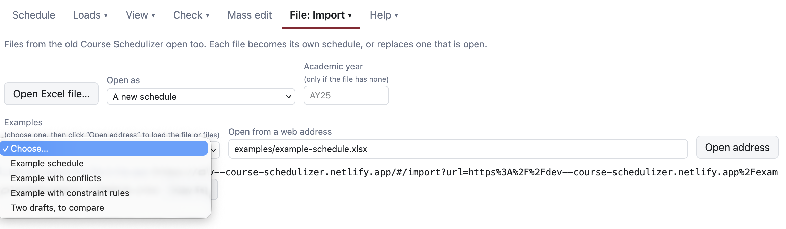

## 2. **Look** over your schedule 

a. Find a section that only meets for half of the semester.

b. Find a section that meets in the evening.

c. Color the schedule by instructor and pull up the color key.

## 3. **Change**  what needs changing.

a. Change the academic year from AY25 to AY26 for all sections. (Mass edit)

b. Change the name of one of the instructors. (Mass edit)

c. Move a section to a different time and/or room?

    * Did your change introduce a conflict?

d. Add a new section to the schedule.

e. Change the nickname of your schedule from 
sample to something else.

## 4. **Check** your schedule.

a. Which instructor has the heaviest/lightest load?

b. How many faculty are on sabbatical?

c. Does the schedule have any conflicts?

## 5. **Export** to Excel 

**File: Meta** has some options for how file names are determined
and other information about the schedule as a whole

a. Add some notes about your schedule.

**File: Export** is where you do the actual export.

b. Export your schedule (download or save to OneDrive)

:::{.callout-caution}
You can, but probably should not, edit the Excel file.
:::

# Working on your own schedule

## Where is Course Schedulizer?

::: {.centered}

<https://schedulizer.pruim.co>

```{r}
url <- "https://schedulizer.pruim.co"
qr_code(url) |>
  generate_svg(
    size = 300,
    foreground = "#8c2131",
    file = "images/schedulizer-qr.svg"
  )
```


:::
## Getting last year's schedule

1. Go to [https://reports.calvin.edu](reports.calvin.edu)
2. Run the Schedulizer Course Sections report:

    a. Choose the terms and the department you want, and view the report.
    b. Export the report as an Excel file (.xlsx). It will land in your browser’s download folder.
    c. Open that file on the Import tab.

3. Use **Mass edit** to change the academic year.

4. **Export** to save a copy

    * Optionally, go to **File > Meta** and change things
      like the nickname and filename to use.

    * You can either download the file or save to OneDrive.
